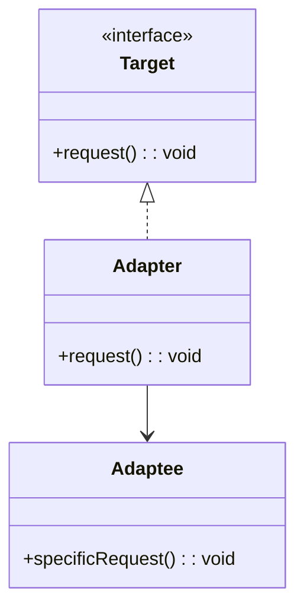
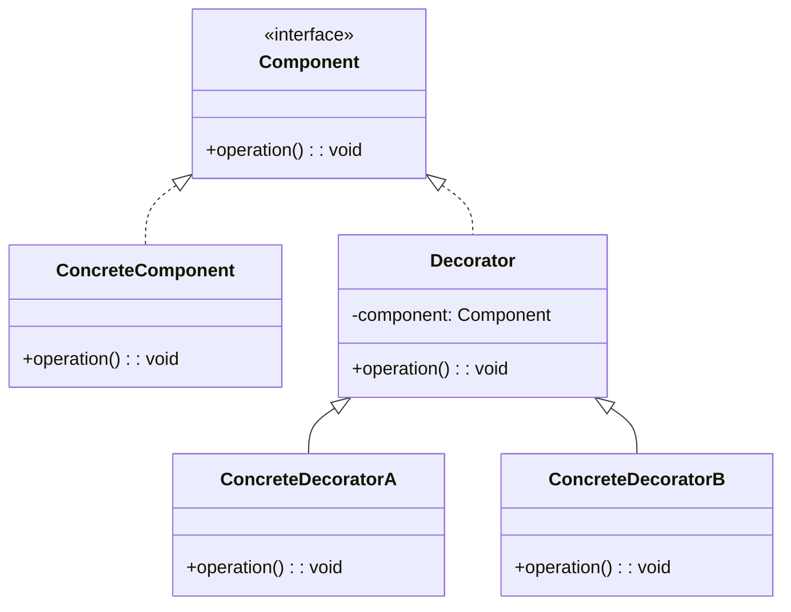
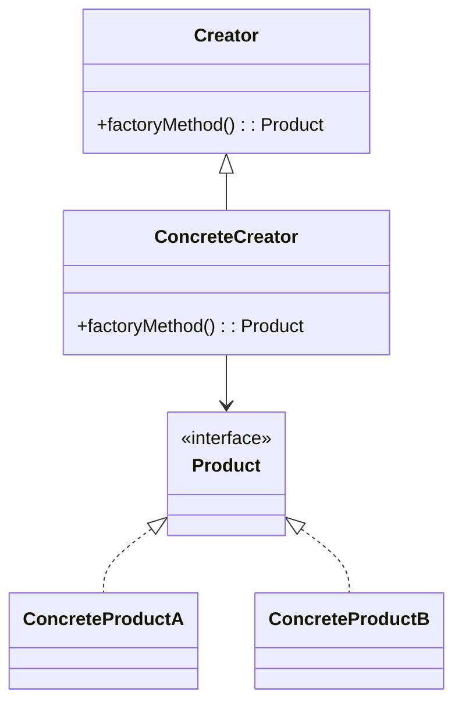
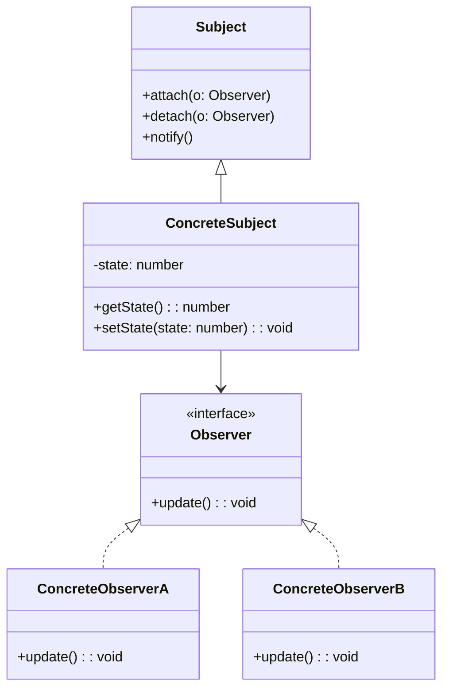
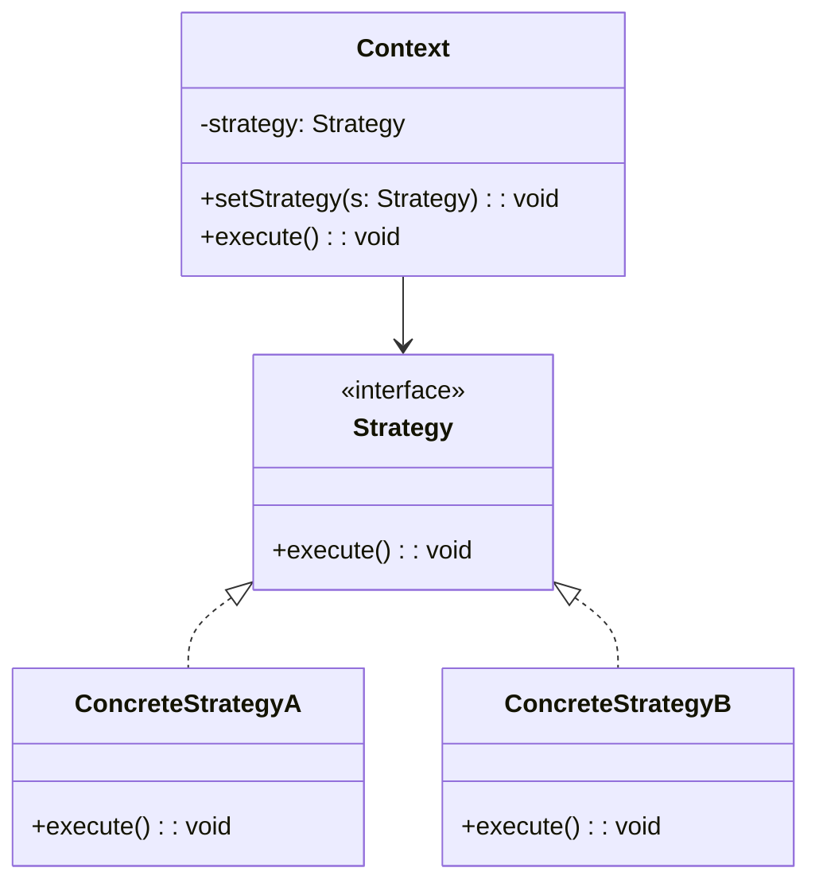

# Design Pattern: Adapter

## Problema

- Interfaces incompatíveis entre sistemas que precisam trabalhar juntos.

## Solução

- Criar um adaptador que converta a interface de uma classe para outra esperada pelo cliente.

## Diagrama em Mermaid

---

# Design Pattern: Decorator

## Problema

- Adicionar funcionalidades em tempo de execução sem alterar o código existente.

## Solução

- Encapsular o objeto original com decoradores que adicionam comportamento.

## Diagrama em Mermaid

---

# Design Pattern: Factory Method

## Problema

- Criação de objetos com muita lógica condicional.
- Código rígido e difícil de manter.

## Solução

- Criar uma interface de criação e mover a lógica de criação para subclasses.

## Diagrama em Mermaid

---

# Design Pattern: Observer

## Problema

- Comunicação acoplada entre componentes que precisam reagir a eventos.

## Solução

- Permitir que objetos observadores se registrem e sejam notificados automaticamente de mudanças.

## Diagrama em Mermaid

---

# Design Pattern: Strategy

## Problema

- Código com múltiplos blocos de `if/else` ou `switch` para comportamentos diferentes.
- Dificuldade para escalar ou alterar comportamentos sem mexer no código existente.
- Viola o Princípio Aberto-Fechado (OCP).

## Solução

- Criar uma interface comum (`Strategy`) com diferentes implementações.
- Delegar o comportamento à interface.

## Diagrama em Mermaid

---

