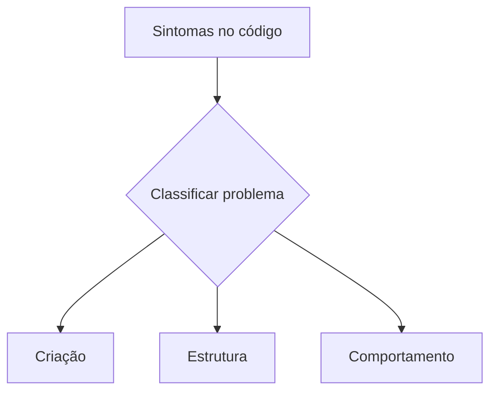
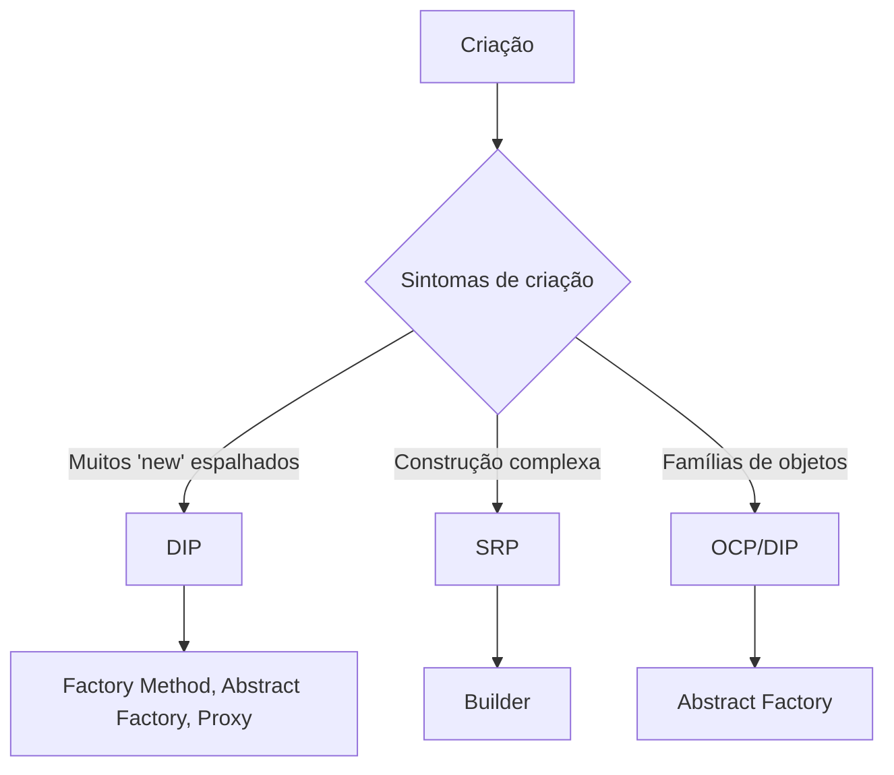
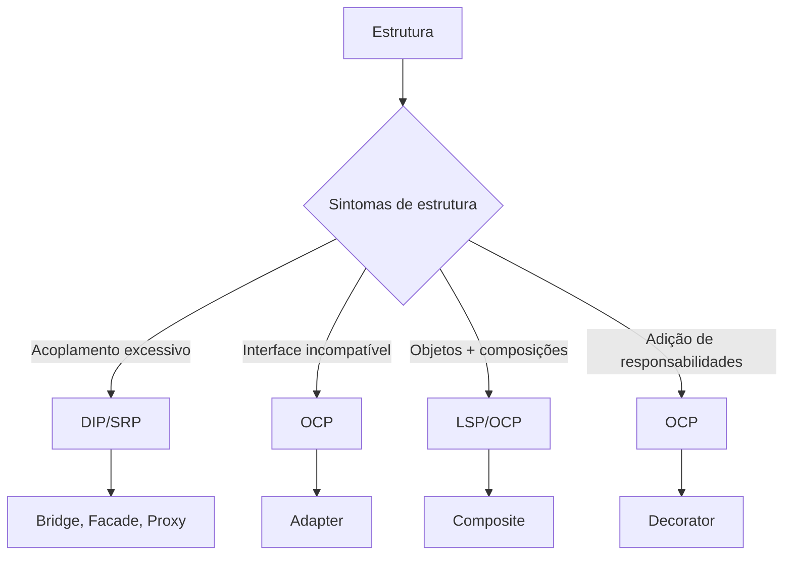
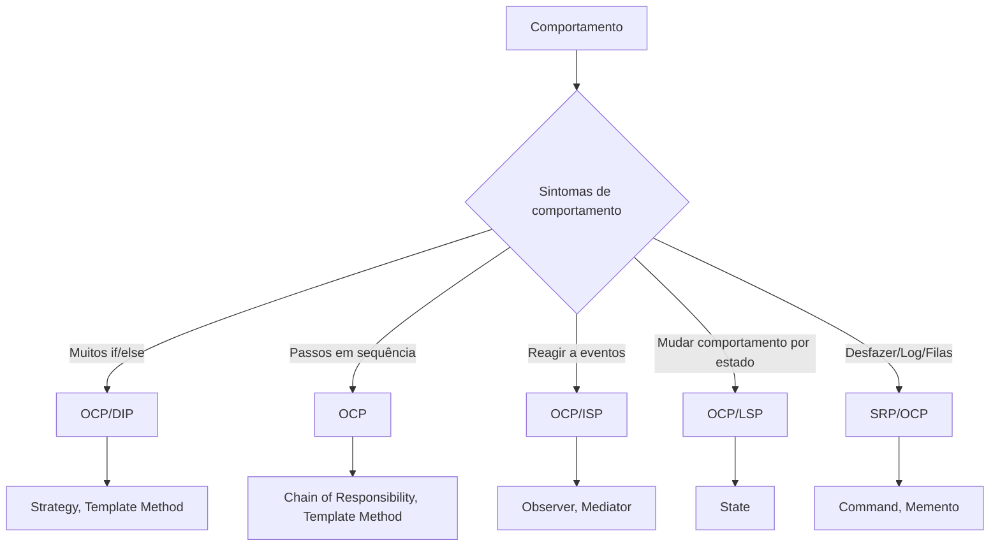

# Diagrama de decisão: SOLID → Padrões GoF

Guia visual para diagnosticar problemas de código e escolher padrões de projeto a partir de **sintomas**, **tipo de problema** (Criação/Estrutura/Comportamento), **princípios SOLID violados** e **padrões GoF** recomendados.

---

## 🗺️ Fluxo geral (Mermaid)

Diagrama alto nível do processo de decisão:

### Diagrama detalhado para Patterns de Criação
---

### Diagrama detalhado para Patterns de Estrutura
---

### Diagrama detalhado para Patterns de Comportamento
---

> **Como usar**: Comece nos sintomas → classifique o tipo de problema → identifique o(s) princípio(s) violado(s) → veja a lista de padrões sugeridos e escolha conforme contexto/forças.

---

## 🔍 Checklist de sintomas

**Criação**  
- Muitos `new` espalhados / difícil de testar  
- Construção com muitos parâmetros/opções  
- Famílias de objetos que precisam variar em conjunto

**Estrutura**  
- Acoplamento alto entre módulos  
- APIs incompatíveis precisam conversar  
- Objetos/coleções tratadas de forma inconsistente  
- Preciso adicionar comportamento sem herdar/modificar classe base

**Comportamento**  
- Regra com muitos `if/else` para variações  
- Pipeline com etapas claramente encadeáveis  
- Eventos e reações entre muitos objetos  
- Comportamento muda conforme estado  
- Preciso desfazer, logar, enfileirar ações

---

## 🧩 Mapa SOLID → Padrões (resumo rápido)

### SRP (Responsabilidade Única)
- **Sinais**: classe "faz de tudo", testes difíceis, responsabilidades misturadas
- **Padrões**: Builder, Command, Facade, Memento, Iterator, Mediator (para centralizar coordenação)

### OCP (Aberto/Fechado)
- **Sinais**: precisa alterar código sempre que entra um caso novo; muitos `if/else`
- **Padrões**: Strategy, Decorator, Template Method, State, Visitor, Adapter, Proxy, Factory Method, Abstract Factory, Observer, Chain of Responsibility

### LSP (Substituição de Liskov)
- **Sinais**: subclasses quebram expectativas/contrato do tipo base
- **Padrões**: State (evita heranças frágeis), Strategy, Template Method, Composite

### ISP (Segregação de Interface)
- **Sinais**: interfaces gordas, métodos inúteis para alguns clientes
- **Padrões**: Observer (contratos mínimos), Mediator (reduz acoplamento entre muitos colegas)

### DIP (Inversão de Dependência)
- **Sinais**: dependência de concretos; difícil substituir/mockar componentes
- **Padrões**: Factory Method, Abstract Factory, Bridge, Proxy, Strategy, Command

---

## 🧭 Tabelas de referência (por categoria)

### Padrões de **Criação**
| Sintoma | SOLID | Padrões |
|---|---|---|
| Muitos `new` / difícil testar | **DIP** | Factory Method, Abstract Factory, Proxy |
| Construção complexa | **SRP** | Builder |
| Famílias de objetos co-variam | **OCP/DIP** | Abstract Factory |

### Padrões **Estruturais**
| Sintoma | SOLID | Padrões |
|---|---|---|
| Acoplamento excessivo | **DIP/SRP** | Bridge, Facade, Proxy |
| Interfaces incompatíveis | **OCP** | Adapter |
| Tratar objeto/coleção igualmente | **LSP/OCP** | Composite |
| Adicionar responsabilidade sem herdar | **OCP** | Decorator |

### Padrões de **Comportamento**
| Sintoma | SOLID | Padrões |
|---|---|---|
| Muitos `if/else` por variação | **OCP/DIP** | Strategy, Template Method |
| Algoritmo em etapas encadeáveis | **OCP** | Chain of Responsibility, Template Method |
| Eventos/reações entre objetos | **OCP/ISP** | Observer, Mediator |
| Comportamento muda por estado | **OCP/LSP** | State |
| Desfazer/filas/log | **SRP/OCP** | Command, Memento |

---

## ✅ Dicas de aplicação
- Comece pelo **menor refactor seguro** que restaure o princípio violado.
- Prefira **composição a herança** quando a intenção for variar comportamento (Strategy/Decorator/State).
- Combine padrões quando fizer sentido (ex.: **Factory Method** para criar **Strategies**).
- Após aplicar, confirme: o princípio SOLID foi **restaurado**? Os testes ficaram **mais fáceis**?

---

## 📎 Observação
Baseado no catálogo GoF e no seu mapeamento SOLID ↔️ Patterns. Ajuste conforme o domínio e restrições do seu projeto.
