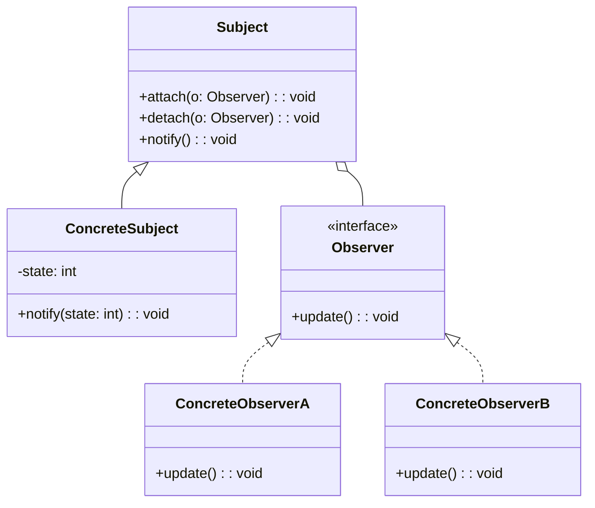

# Design Pattern: Observer

## Problema

* Um objeto precisa notificar diversos outros objetos sobre mudanças de estado, criando um acoplamento excessivo.
* Dificuldade em manter a consistência entre objetos dependentes quando o estado do objeto principal muda.
* Viola o princípio do baixo acoplamento e da separação clara de responsabilidades.

## Intenção

Permitir que um objeto notifique outros objetos sobre mudanças de estado de forma flexível e desacoplada.

## Solução

* Definir uma interface comum para observadores (`Observer`) que receberão notificações.
* Manter uma lista de observadores no objeto principal (o `Subject`) que envia notificações sempre que seu estado muda.
* Os observadores implementam a interface para reagir às notificações de forma independente, reduzindo acoplamento.

## Diagrama (GOF)

