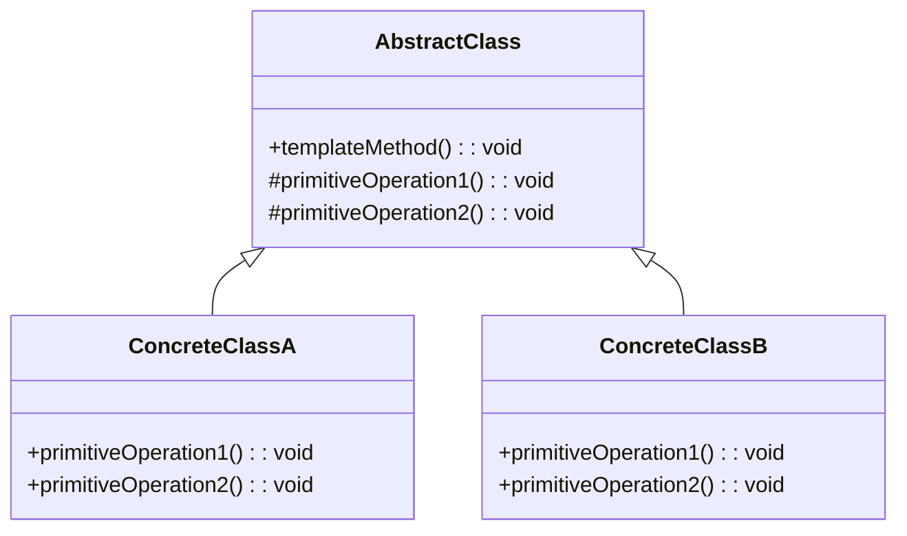

# Design Pattern: Template Method

## Problema
-	Diversas classes compartilham um mesmo algoritmo com pequenas variações em etapas específicas.
-	Copiar e colar a estrutura geral do algoritmo em cada classe resulta em código duplicado e difícil de manter.
-	As variações específicas de cada classe não justificam uma lógica inteira própria, mas apenas mudanças em partes do fluxo.

## Solução
-	Definir a estrutura geral de um algoritmo em uma classe abstrata.
-	Permitir que subclasses implementem ou sobrescrevam apenas etapas específicas do algoritmo.
-	As etapas do algoritmo são chamadas dentro de um método “template”, que define a ordem e o fluxo completo da operação.

## Princípios SOLID Relacionados
-	**OCP (Open/Closed Principle)** – novas variações de comportamento são adicionadas via subclasses sem alterar o algoritmo principal.
-	**LSP (Liskov Substitution Principle)** – subclasses podem ser usadas no lugar da classe base sem quebrar a lógica do algoritmo.
-	**SRP (Single Responsibility Principle)** – separa a estrutura do algoritmo (classe base) da implementação das etapas (subclasses).

Diagrama (GOF)

## Observações
-	O método templateMethod() define o esqueleto do algoritmo e não deve ser sobrescrito.
-	As etapas “primitivas” podem ser:
-	abstratas (obrigatórias para subclasses)
-	com implementação default (opcionalmente sobrescritas)
-	hooks (métodos vazios para permitir extensão sem obrigatoriedade)